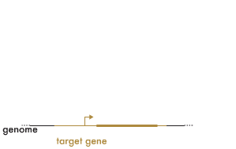

<h1 class="page-title">CiBER-Seq</h1>

<h3>CRISPR interference with barcode expression reporter sequencing</h3>

CiBER-Seq is a technique for measuring quantitative profiles of the
changes in a specific molecular phenotype, such as gene expression,
across a comprehensive library of CRISPR-mediated genetic
perturbations. These measurements are made by bulk sequencing of RNA
and DNA extracted from pooled populations, and don't require
fluorescent protein expression or cell sorting. CiBER-Seq directly
profiles RNA abundance, which is often advantageous relative to
protein-based reporters. However, it can be adapted to study
protein-level phenotypes, such as regulated translation or degradation, by
using a heterologous transcription factor to transduce that regulation
into RNA expression.

This site is a resource for CiBER-Seq, based on our work in [Muller et
al., 2020](FORTHCOMING). It builds on our [genome-wide CRISPRi
library](https://ingolia-lab.github.io/yeast-crispri/) described in
[McGlincy et al., 2020](https://doi.org/10.1101/2020.03.11.988105).

